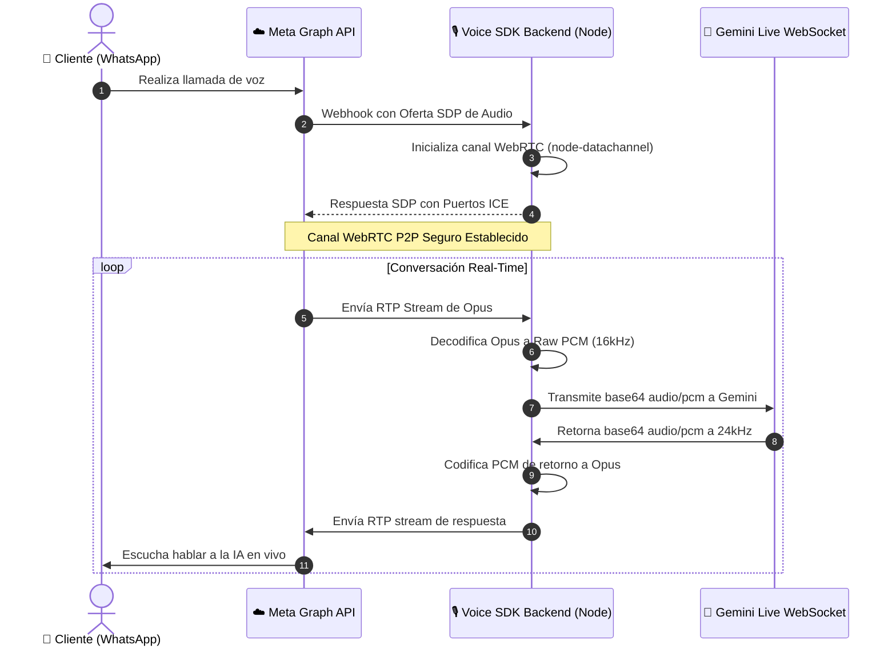

# 🎙️ WhatsApp Voice SDK — WhatsApp Real-Time Calls + Gemini Live Integration Template

<div align="center">
  
  
  
  
</div>

---

## 🚀 ¿Qué es el WhatsApp Voice SDK?

Este repositorio es un **acelerador de código B2B y plantilla comercial premium** diseñada específicamente para desarrolladores, agencias de software y fundadores de SaaS que desean integrar **llamadas de voz de WhatsApp en tiempo real controladas por Inteligencia Artificial**.

Integrar telefonía real en la nube requiere lidiar con la compleja API de Meta, negociar parámetros WebRTC (SDP, ICE Candidates) a bajo nivel, decodificar Opus RTP entrante a PCM lineal en tiempo real, e inyectar el audio en la API WebSocket de Gemini Live de baja latencia. **Este kit hace todo el trabajo duro por ti, ahorrándote más de 3 meses de investigación y miles de dólares en desarrollo.**

---

## 🛠️ Estructura del Kit

El kit está perfectamente modularizado y limpio de dependencias innecesarias:
* **`frontend/`**: Landing Page de venta y panel de Sandbox interactivo (HTML, CSS y JS puro). Cuenta con formularios glassmorphism, luces de estado de neón y una consola terminal para monitorizar logs de WebSockets de llamadas en vivo.
* **`backend/`**: Servidor Node.js/Express ultra-documentado que procesa los Webhooks de Meta, inicializa el canal Peer-to-Peer con `node-datachannel`, realiza la transcodificación básica de Opus/PCM y gestiona el WebSocket bidireccional hacia **Gemini Live API**.

---

## 🔄 Flujo de Arquitectura de Voz



---

## 📦 Puesta en Marcha Rápida (Quick Start)

### 1. Levantar el Backend (Puerto 3006)
1. Navega a la carpeta de backend:
   ```bash
   cd backend
   ```
2. Instala las dependencias de bajo nivel y red:
   ```bash
   npm install
   ```
3. Copia la plantilla de variables de entorno y completa tus llaves:
   ```bash
   cp .env.example .env
   ```
4. Inicia el servidor en modo desarrollo:
   ```bash
   npm run dev
   ```

### 2. Abrir el Sandbox Frontend
Simplemente abre el archivo [`frontend/index.html`](file:///c:/Users/HP/OneDrive/Documentos/GitHub/chat-bots/whatsapp-voice-sdk/frontend/index.html) en tu navegador preferido. ¡Listo! La UI se enlazará con tu servidor local mediante WebSockets de forma automática.

---

## 📱 Guía Paso a Paso para Meta Developer Portal

Para recibir llamadas reales desde WhatsApp en este kit, sigue estas directrices estructurales:

1. **Crear App en Meta Developers:**
   * Entra a [Meta for Developers](https://developers.facebook.com/) y regístrate.
   * Crea una nueva aplicación de tipo **Negocios (Business)**.
   * Agrega el producto de **WhatsApp** en el menú de la izquierda.
2. **Configurar el Webhook:**
   * Expón tu puerto local `3006` a Internet mediante una herramienta de túneles segura (ej. `ngrok http 3006` o Cloudflare Tunnels).
   * En la configuración de WhatsApp en Meta, haz clic en **Webhooks**.
   * Pega tu URL expuesta (ej. `https://tu-subdominio.ngrok.app/webhook`) y escribe tu `META_VERIFY_TOKEN` personalizado.
   * **¡Importante!** Suscríbete a los campos `messages` y `call_events` para que Meta te envíe las llamadas entrantes.
3. **Habilitar Teléfonos de Prueba:**
   * En la pestaña **Configuración de la API** de WhatsApp, añade un número de prueba y el número personal del cliente autorizado para llamar.
   * Realiza una llamada de voz al número de prueba de WhatsApp y observa la consola Sandbox de este kit enlazarse, negociar SDP y hablar en tiempo real.

---

## 🔒 Licencia Comercial y Soporte

Este kit se distribuye bajo una **Licencia de Uso Comercial**. Está prohibida la reventa pública del repositorio o su redistribución sin autorización. Puedes utilizarlo para construir tus propios SaaS de voz ilimitados o revender desarrollos finales integrados a tus clientes corporativos.

Desarrollado con honor por **Luis Damian Veliz** y el futuro equipo de **NEURO IA S.A.S** 🚀
📧 [lveliz213@hotmail.com](mailto:lveliz213@hotmail.com) | 📱 +593 987 865 420
